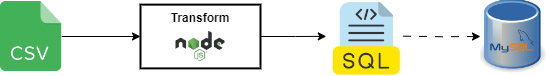

# CSV to MySQL script migration
This service perform a transformation from a raw CSV file to a .sql script file to be executed on MySQL.

## Requirements
- Node 16 or higher

## Getting started

- Edit config.json based on your needs
- run `node index.js`
